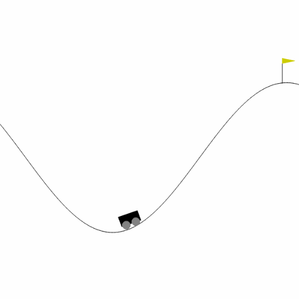

 # SARSA-DeepAscent: Mastering the MountainCar Environment with Deep Reinforcement Learning
Sit Back and Enjoy the Thrill: Deep Reinforcement Learning Agent Navigates the Treacherous Mountain Car Terrain!

 
 This repository contains an implementation of the Deep SARSA algorithm, a powerful reinforcement learning technique that combines the SARSA (State-Action-Reward-State-Action) 
 algorithm with deep neural networks. The project focuses on applying Deep SARSA to the challenging MountainCar environment from the OpenAI Gym.
 
 The MountainCar environment tasks the agent with driving an underpowered car up a steep mountain by strategically building momentum.
 The Deep SARSA algorithm learns an optimal policy to accomplish this goal through trial and error, leveraging the power of deep learning to approximate the action-value function.

 Key Features:
- Implementation of the Deep SARSA algorithm using PyTorch
- Modular and object-oriented design for easy understanding and extensibility
- Preprocessing of the MountainCar environment for seamless integration with the Deep SARSA agent
- Experience replay memory for stabilizing the learning process
- Visualization of training statistics, cost-to-go function, and optimal action policy
- Saving of training figures and videos for analysis and demonstration purposes

This repository serves as a valuable resource for those interested in deep reinforcement learning and provides a practical example of applying the Deep SARSA algorithm to a 
challenging control problem. The code is well-documented and organized, making it accessible to both beginners and experienced practitioners.

Whether you are a researcher, student, or enthusiast in the field of reinforcement learning, this project offers an opportunity to explore and gain insights into the power of combining deep learning with 
traditional reinforcement learning techniques. Join the adventure of mastering the MountainCar environment with SARSA-DeepAscent!

## Overview
The Deep SARSA algorithm is a reinforcement learning algorithm that learns an optimal policy for an environment using a neural network (Q-network) to 
approximate the Q-values for each state-action pair. The algorithm interacts with the environment, stores transitions in a 
replay buffer, and performs Q-learning updates using the sampled transitions. The target Q-network is used to stabilize the learning process.

## Installation
1. Clone the repository:
   git clone https://github.com/sohrabsarabian/SARSA-DeepAscent.git
2. Install the required dependencies:
   pip install -r requirements.txt

## Usage
To run the Deep SARSA algorithm on the MountainCar environment, execute the following command:
- python main.py

The script will train the Deep SARSA agent for a specified number of episodes, plot the training statistics, visualize the learned cost-to-go and policy, and test the trained agent in the environment.

## Modules
The repository consists of the following modules:
- env_utils.py: Contains utility classes for preprocessing the environment.
- models.py: Defines the Q-network model.
- replay_memory.py: Implements the experience replay buffer.
- deep_sarsa.py: Contains the main Deep SARSA algorithm implementation.
- main.py: The entry point of the program, where the algorithm is executed and results are displayed.

## Results
After running the script, you will see the following outputs:

- Training statistics plots showing the MSE loss and episode returns over the course of training.
- Visualization of the learned cost-to-go function.
- Visualization of the resulting policy.
- Rendered episodes of the trained agent interacting with the environment.

## Dependencies
The code requires the following dependencies:

- Python 3.x
- PyTorch
- OpenAI Gym
- NumPy
- Matplotlib
- tqdm

The specific versions of these dependencies are listed in the requirements.txt file.

## License
This project is licensed under the Apache License 2.0.
